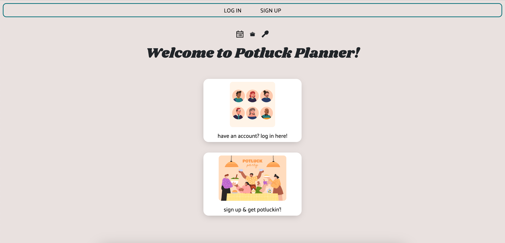
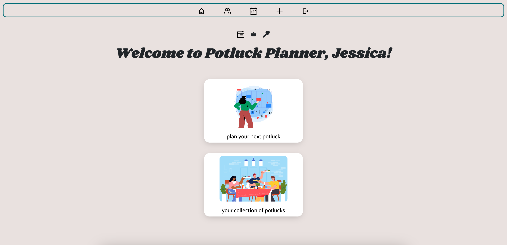
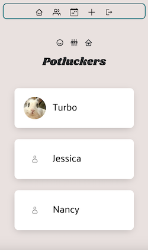
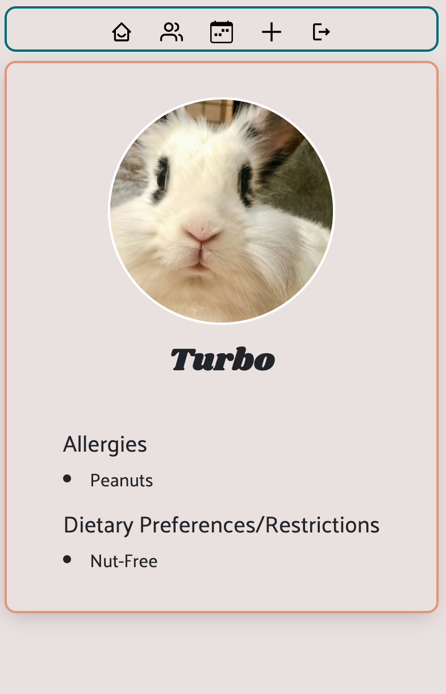
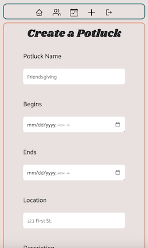
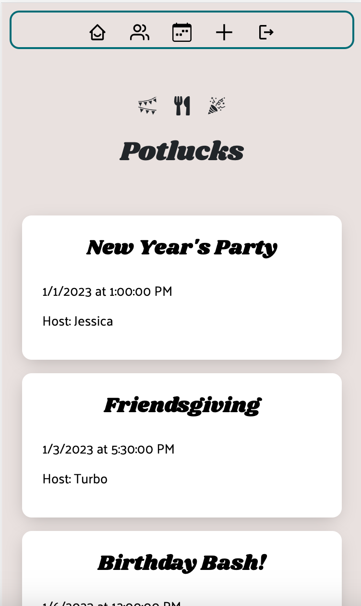
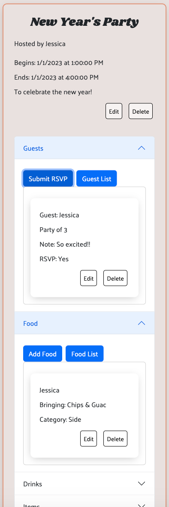
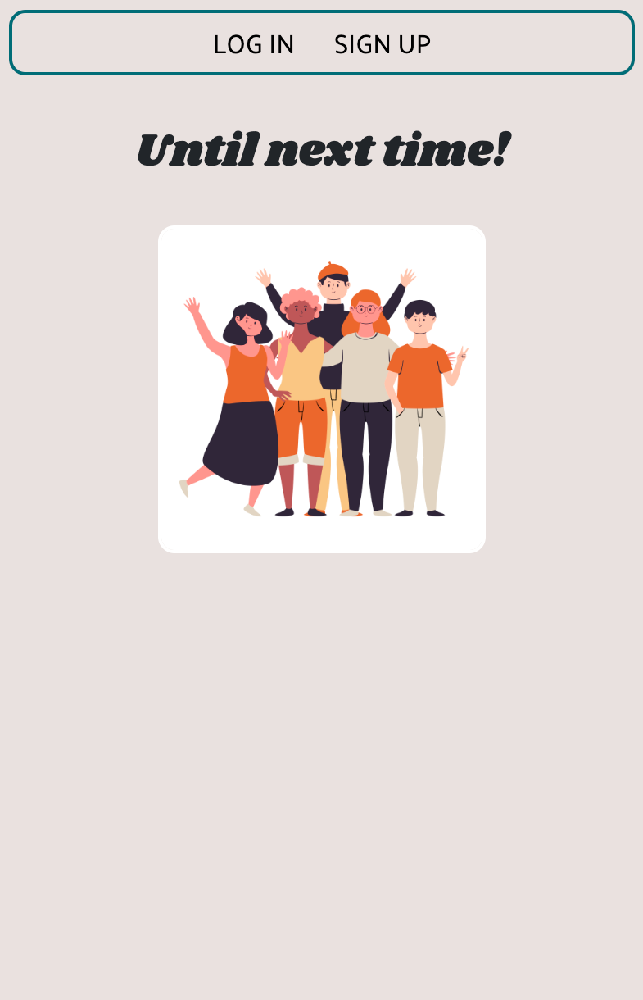

# Potluck Planner

## LINK BELOW 👇🏼
## [Potluck Planner](https://get-potluckin.netlify.app) 

## Background & Description
🥘 Welcome to **Potluck Planner**! 🥘  
Here to help host your next potluck party!

This side project was inspired by and built for my friend, Rina, who enjoys hosting potluck parties in her home and was interested in using another planning tool outside of Google spreadsheets. I thought this would be a good opportunity for me to build another full-stack application using the MERN stack and become more familiar with using React.

## Screenshots of the App 📸

 

## Technology Used
  - AJAX
  - CSS
  - Express
  - Git/GitHub
  - HTML
  - JavaScript
  - JSON Web Token
  - Mongoose/MongoDB
  - Node
  - React

## Credits
- [Animate](https://animate.style/)
- [Bootstrap](https://getbootstrap.com/)
- [Favicon.io](https://favicon.io/)
- [Freepik](https://www.freepik.com/)
- [Google Fonts](https://fonts.google.com/)
- [React Icons](https://react-icons.github.io/react-icons)

## Icebox Items 🧊
  - [ ] Add back button icons to easily go back to the previous page
  - [ ] Implement a friend request feature
  - [ ] List potlucks, hosted by the user, on their profile details page
  - [ ] Create a blog page where recipes can be shared
  - [ ] Change dietary preferences/restrictions from a select list to checkboxes
  - [ ] Add a feature where users can update/remove their profile photos
